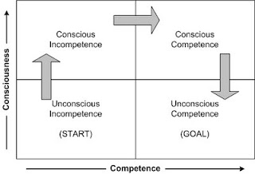
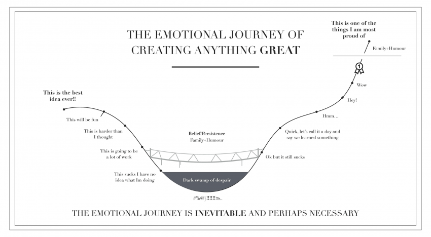

# What To Expect In Module 3

## But First

### Congratulations!

At this point in time you've actually gained the knowledge and context necessary to call yourself a "Junior Rails Developer", and this is no small feat.
___
## The Journey of Learning Something New

### The Stages of Learning
You will see below an image that illustrates the stages of learning that each of us goes through, at least when it comes to programming:

1. START: You don't what the road to knowledge looks like.

2. SECOND: You now know what the road looks like, and subsequently you know you're rather far from your end-goal.

3. THIRD: Getting to the goal via the road, acknowledging an increase in knowledge along the way.

4. GOAL: You got to the goal and moved on to other roads! You also took the knowledge with you!

### The Emotional Journey of Creating Anything Great
You will see below an image that illustrates the emotional journey of creating anything great. We want you to take a look at this because there is much that you and your cohort mates can take away from it as you enter the most intensive of the five modules:

1. The first point we want share with you is that it is normal to feel the weight of Module 3 (and the entire program) on your shoulders, you will not be alone in however you will be feeling. You and your cohort mates are all going through it together, so lean on each other.

2. The second point we want to share with you is that you should try to be aware of where you find yourself mentally and emotionally, and should act accordingly to attempt to stay out of the dark swamp. Lean on family, and remember to have confidence in your support system. If the administrative support system available to you is not clear, talk to an instructor and a meeting can be arranged between the both of you and an administrator such as the Senior Program Manager.

### Putting It Together
We know Javascript is new to most (if not all) of you, and that many times when a student gets to the second step of "The Stages of Learning" and sees how long that road is, any student may feel discouragement. We want you to harness the above two points and to keep confidence in the curriculum; it is a thoroughly crafted, thoroughly tested, and further refined system that is built to get you ready for the workforce!

### Personal Empowerment Protocol
1. Read the Error

2. Google the Problem

3. Ask a Neighbor

4. Ask an Instructor
___
## The Content

Module 3 can be considered "front-loaded", meaning that the beginning of the module is heavier in content than the rest. The first week, including the weekend prior to the Monday of the first week, contains the majority of the material. The second week contains labs and activities built to help digest and practice the content introduced throughout week 1.

### Things to Know

* The material is more difficult because it is a new language with new quirks and vocabulary.

* The material requires much critical thinking, more than previous modules. You cannot pattern match to solve the labs.

* One topic does not always flow into the other. This is because Javascript has many moving parts.

* Ruby gave you multiple names for the same method, which may have been confusing when you learned iterators. JavaScript gives you even more flexibility on how to structure your code than Ruby.

___

## Independence

We want to empower you to take control of your own learning. This means learning to teach yourself how to approach new topics, debug, and find the answers to conceptual questions.

For this reason, instructors will start to steer you towards resources, rather that answer your questions. We aren’t avoiding the question, we want to see if you can read documentation and master google-fu. These are the skills you will need in your first job!

___
## Resources

* [Example 1](https://www.youtube.com/watch?v=-jrEbj4iCQ8)

* [Example 2](https://www.youtube.com/watch?v=vENMFapLonA)
